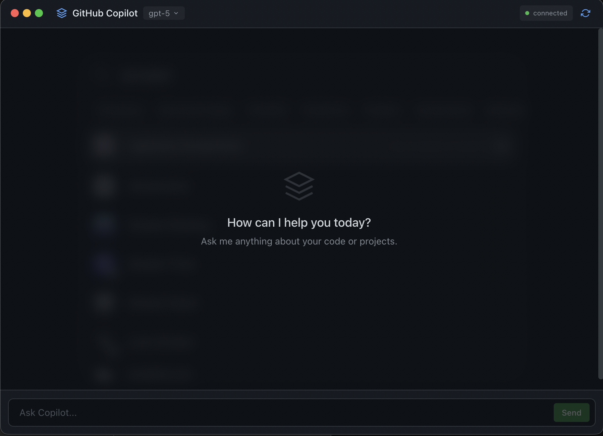

# Copilot UI

A beautiful native desktop GUI for GitHub Copilot, built with Electron and the [Copilot SDK](https://github.blog/changelog/2026-01-14-copilot-sdk-in-technical-preview/).



## Features

- 🎨 **Clean chat interface** - Modern dark theme matching GitHub's design
- 🤖 **Multiple models** - Switch between GPT-5, Claude Sonnet 4.5, Claude Sonnet 4, and GPT-4.1
- 🔧 **Tool execution** - Visual indicators for running tools
- 📝 **Markdown rendering** - Rich formatting for responses (lists, code blocks, bold, etc.)
- 💾 **Persistent settings** - Your model preference is saved across sessions
- ⚡ **Streaming responses** - See answers as they're generated

## Prerequisites

- Node.js 18+
- GitHub Copilot subscription
- GitHub CLI authenticated (`gh auth login`)

## Installation

```bash
npm install
```

> **Note:** pnpm may have memory issues with some Node.js versions. Use npm if you encounter problems.

## Development

```bash
npm run dev
```

## Build

```bash
npm run build
```

## How It Works

This app uses the official [GitHub Copilot SDK](https://www.npmjs.com/package/@github/copilot-sdk) to communicate directly with GitHub Copilot. It creates a native Electron window with a React-based chat interface.

The SDK uses your existing GitHub authentication (via `gh` CLI) to authenticate requests.

## Tech Stack

- **Electron** - Native desktop app
- **React** - UI framework
- **TypeScript** - Type safety
- **Tailwind CSS** - Styling
- **Copilot SDK** - GitHub Copilot integration
- **electron-store** - Settings persistence
- **react-markdown** - Response formatting

## License

MIT
